# 🧬 scATAC-seq Analysis Pipeline & Interactive EDA App
## Human PBMCs — 10x Genomics ATACv2 (10k cells)

> **Acknowledgement:** Portions of this pipeline were adapted from code and
> concepts demonstrated in the
> **[Bioinformagician YouTube channel](https://www.youtube.com/@Bioinformagician)**.
> Their scATAC-seq tutorial walkthrough was instrumental in shaping the
> structure of `ATACSeq_complete_pipeline.R`. Full credit to the channel
> for making high-quality bioinformatics education publicly available.

---

## 📋 Table of Contents

1. [Repository Contents](#1-repository-contents)
2. [What This Project Does](#2-what-this-project-does)
3. [Requirements](#3-requirements)
4. [Data Downloads](#4-data-downloads)
5. [Pipeline Results — Plot Gallery](#5-pipeline-results--plot-gallery)
6. [How to Run the Pipeline](#6-how-to-run-the-pipeline)
7. [How to Launch the Shiny App](#7-how-to-launch-the-shiny-app)
8. [Shiny App — Full User Guide](#8-shiny-app--full-user-guide)
9. [File Descriptions](#9-file-descriptions)
10. [Common Errors and Fixes](#10-common-errors-and-fixes)

---

## 1. Repository Contents

```
📁 your-project/
│
├── 📄 ATACSeq_complete_pipeline.R    ← Full analysis pipeline (run this first)
├── 📄 Shiney_App_For_EDA.R           ← Interactive Shiny EDA app (run second)
├── 📄 README.md                      ← This file
│
├── 🖼  Rplot.png                      ← QC: Density scatter (nCount vs TSS)
├── 🖼  Rplot01.png                    ← QC: Fragment size histogram
├── 🖼  Rplot02.png                    ← QC: Violin plots (5 QC metrics)
├── 🖼  Rplot03.png                    ← Depth correlation (LSI components)
├── 🖼  Rplot04.png                    ← UMAP — Leiden clusters
├── 🖼  Rplot05.png                    ← UMAP — Marker gene activity
├── 🖼  Rplot06.png                    ← Label transfer: ATAC vs RNA
├── 🖼  Rplot07.png                    ← UMAP — Predicted cell type labels
├── 🖼  Rplot08.png                    ← DA: Violin + UMAP for top DA peak
├── 🖼  Rplot09.png                    ← Coverage plot: chr12 (BICDL1)
├── 🖼  Rplot10.png                    ← Coverage plot: CD8A (chr2)
│
└── 📁 data/
    ├── pbmc_atac_final.rds            ← Generated by pipeline (required by app)
    ├── pbmc_atac_part1.rds            ← Part 1 checkpoint
    ├── da_peaks_results.rds           ← Differential accessibility results
    └── pbmc_atac_clusters.csv         ← Cluster label export
```

---

## 2. What This Project Does

### `ATACSeq_complete_pipeline.R`

A complete two-part scATAC-seq analysis pipeline:

| Part | Steps | What happens |
|------|-------|--------------|
| **Part 1** | 1–6 | Load fragment file → filter chromosomes → annotate hg38 genes → QC → TF-IDF + LSI → UMAP + Leiden clustering |
| **Part 2** | 7–11 | Gene activity scoring → label transfer from scRNA-seq → differential accessibility → coverage plots |

### `Shiney_App_For_EDA.R`

An interactive browser that lets you explore chromatin accessibility
by chromosome, gene, and cell type — with no coding required after launch.

---

## 3. Requirements

**R 4.4 or higher** required.

```r
# Install all required packages (run once)
if (!requireNamespace("remotes",     quietly = TRUE)) install.packages("remotes")
if (!requireNamespace("BiocManager", quietly = TRUE)) install.packages("BiocManager")

remotes::install_github("stuart-lab/signac", ref = "develop")

install.packages(c("shiny", "shinydashboard", "ggplot2", "dplyr",
                   "ggsignif", "patchwork", "DT"))

BiocManager::install(c("Seurat", "AnnotationHub", "GenomicRanges",
                        "GenomeInfoDb", "biovizBase"))
```

---

## 4. Data Downloads

Run these in your terminal inside the project folder:

```bash
# Peak-barcode count matrix
wget https://cf.10xgenomics.com/samples/cell-atac/2.1.0/10k_pbmc_ATACv2_nextgem_Chromium_Controller/10k_pbmc_ATACv2_nextgem_Chromium_Controller_filtered_peak_bc_matrix.h5 -O filtered_peak_bc_matrix.h5

# Per-cell QC metadata
wget https://cf.10xgenomics.com/samples/cell-atac/2.1.0/10k_pbmc_ATACv2_nextgem_Chromium_Controller/10k_pbmc_ATACv2_nextgem_Chromium_Controller_singlecell.csv -O singlecell.csv

# Fragment file + tabix index (both required)
wget https://cf.10xgenomics.com/samples/cell-atac/2.1.0/10k_pbmc_ATACv2_nextgem_Chromium_Controller/10k_pbmc_ATACv2_nextgem_Chromium_Controller_fragments.tsv.gz -O fragments.tsv.gz
wget https://cf.10xgenomics.com/samples/cell-atac/2.1.0/10k_pbmc_ATACv2_nextgem_Chromium_Controller/10k_pbmc_ATACv2_nextgem_Chromium_Controller_fragments.tsv.gz.tbi -O fragments.tsv.gz.tbi

# scRNA-seq reference for label transfer
wget https://signac-objects.s3.amazonaws.com/pbmc_10k_v3.rds
```

---

## 5. Pipeline Results — Plot Gallery

---

### Plot 1 — QC: Density Scatter (nCount_peaks vs TSS Enrichment)

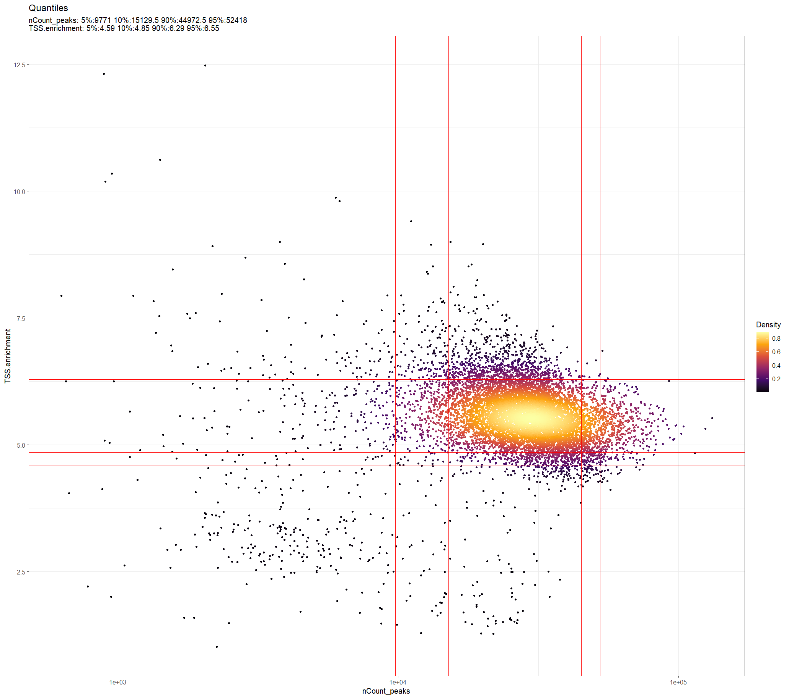

**What this shows:** Each dot is one cell. x-axis = total fragments per cell
(log scale); y-axis = TSS enrichment score. Red lines mark the 5th, 10th,
90th, and 95th percentile thresholds. High-quality cells cluster top-right.

**Key insight from this dataset:** Most cells have `nCount_peaks` between
9,771–44,973 and TSS enrichment between 4.59–6.29. The tight cluster with
high density (yellow centre) represents the bulk of genuine cells. The sparse
outliers at low counts and low TSS are likely empty droplets.

---

### Plot 2 — QC: Fragment Size Histogram (Nucleosome Signal Groups)

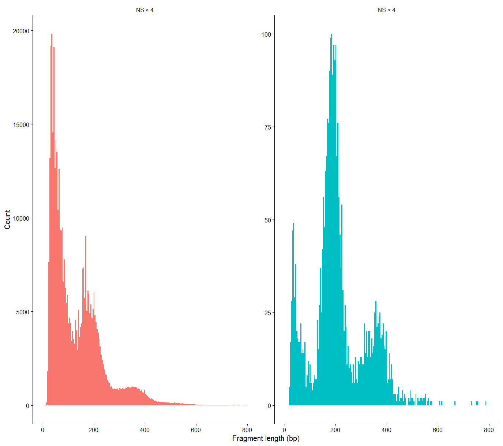

**What this shows:** Fragment length distribution split by nucleosome signal
threshold (NS < 4 = good quality on the left; NS > 4 = poor quality on the right).

**Key insight:** The left panel shows the textbook ATAC-seq nucleosomal
banding pattern — a strong sub-nucleosomal peak at ~100 bp (Tn5 cuts in
accessible chromatin) and a smaller mono-nucleosomal peak at ~200 bp.
The NS > 4 group (right, only ~100 cells) has a distorted pattern,
confirming the nucleosome signal filter correctly identifies poor cells.

---

### Plot 3 — QC: Violin Plots (5 QC Metrics)

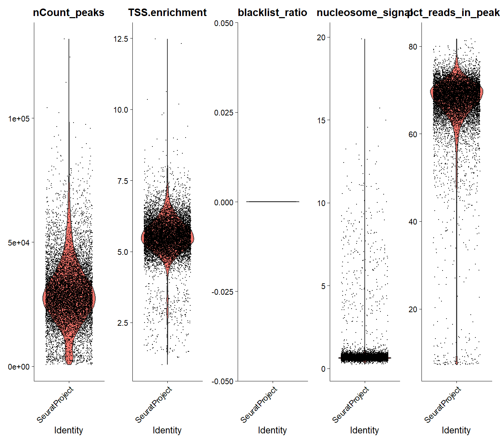

**What this shows:** Distribution of five QC metrics across all cells before
filtering. Left to right: total fragments (`nCount_peaks`), TSS enrichment,
blacklist ratio, nucleosome signal, and % reads in peaks.

**Key insight:** `blacklist_ratio` is essentially zero for all cells
(very narrow violin centred at 0), confirming minimal artefact contamination.
`pct_reads_in_peaks` is broadly distributed but centred at ~60–80%.
The high `nCount_peaks` violin shows this is deeply sequenced ATACv2 data.

---

### Plot 4 — Depth Correlation (LSI Components)

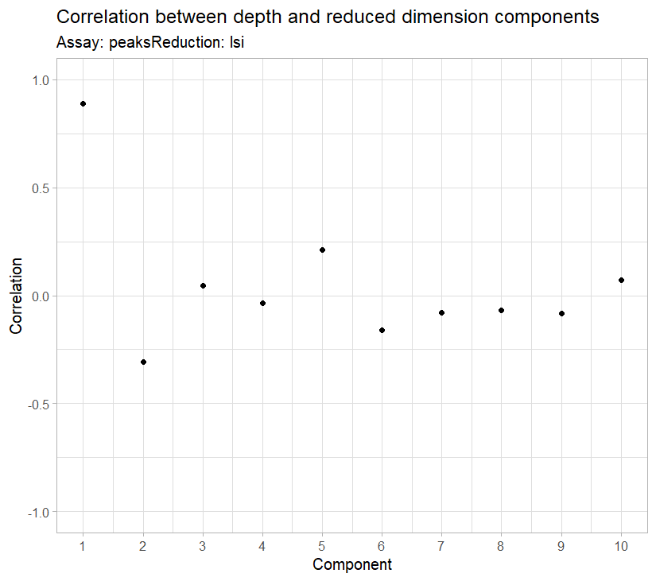

**What this shows:** Pearson correlation between each LSI component and
sequencing depth (total fragments per cell).

**Key insight:** LSI component 1 has correlation ≈ +0.88 — it captures
sequencing depth, not biology, and is excluded from all downstream analyses
(`dims = 2:30`). Components 2–10 show correlations near zero, meaning they
capture genuine chromatin accessibility differences between cell types.

---

### Plot 5 — UMAP with Leiden Clusters

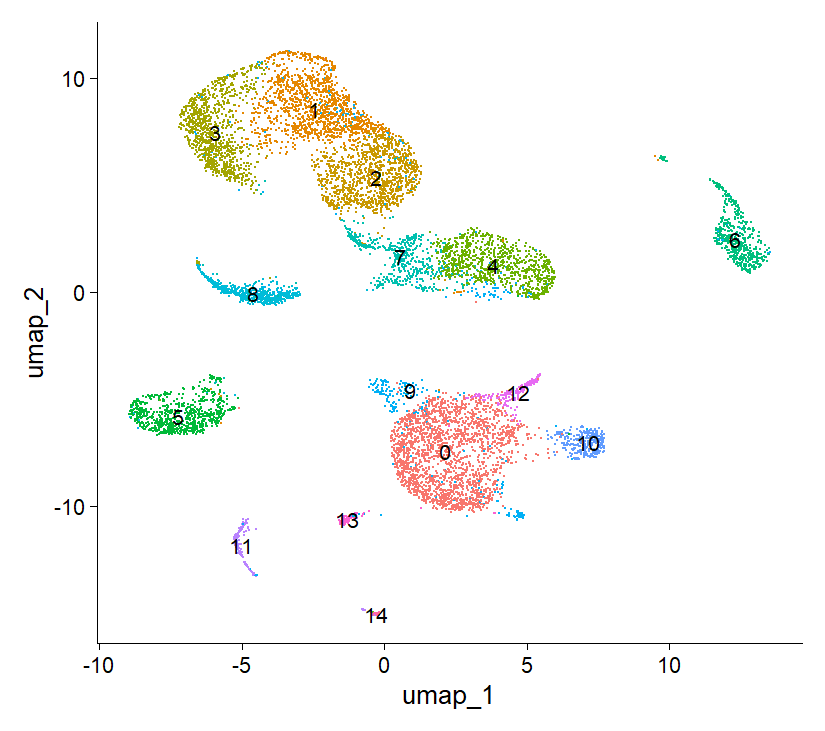

**What this shows:** UMAP projection of all cells after QC and LSI reduction.
Each colour = one Leiden cluster (resolution = 0.5). **15 clusters** were identified (0–14).

**Key insight:** The UMAP shows clear, well-separated clusters corresponding
to major PBMC lineages. The large central mass (cluster 0) and surrounding
islands (1–4) likely represent T cell subsets. The isolated groups at
left (clusters 5, 8, 11) and right (cluster 6) are likely monocytes, NK cells,
and B cells.

---

### Plot 6 — UMAP: Marker Gene Activity

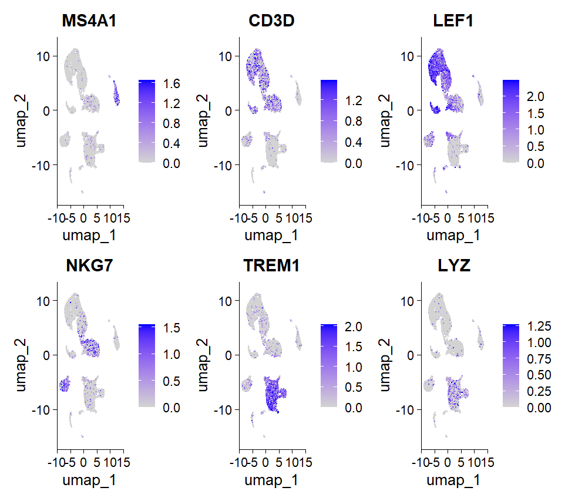

**What this shows:** Gene activity scores for six canonical PBMC markers
projected onto the UMAP. Darker blue = higher estimated chromatin accessibility
at that gene locus.

| Gene | Marks |
|------|-------|
| `MS4A1` (CD20) | B cells |
| `CD3D` | All T cells |
| `LEF1` | Naive T cells specifically |
| `NKG7` | NK cells |
| `TREM1` | Monocytes / neutrophils |
| `LYZ` | Monocytes |

**Key insight:** Gene activity patterns match known PBMC biology — `MS4A1`
is restricted to a small isolated cluster (B cells), `CD3D` and `LEF1`
are co-expressed in the large upper clusters (T cells), and `LYZ`/`TREM1`
mark the separated left-side clusters (monocytes).

---

### Plot 7 — Label Transfer: ATAC vs RNA Side-by-Side

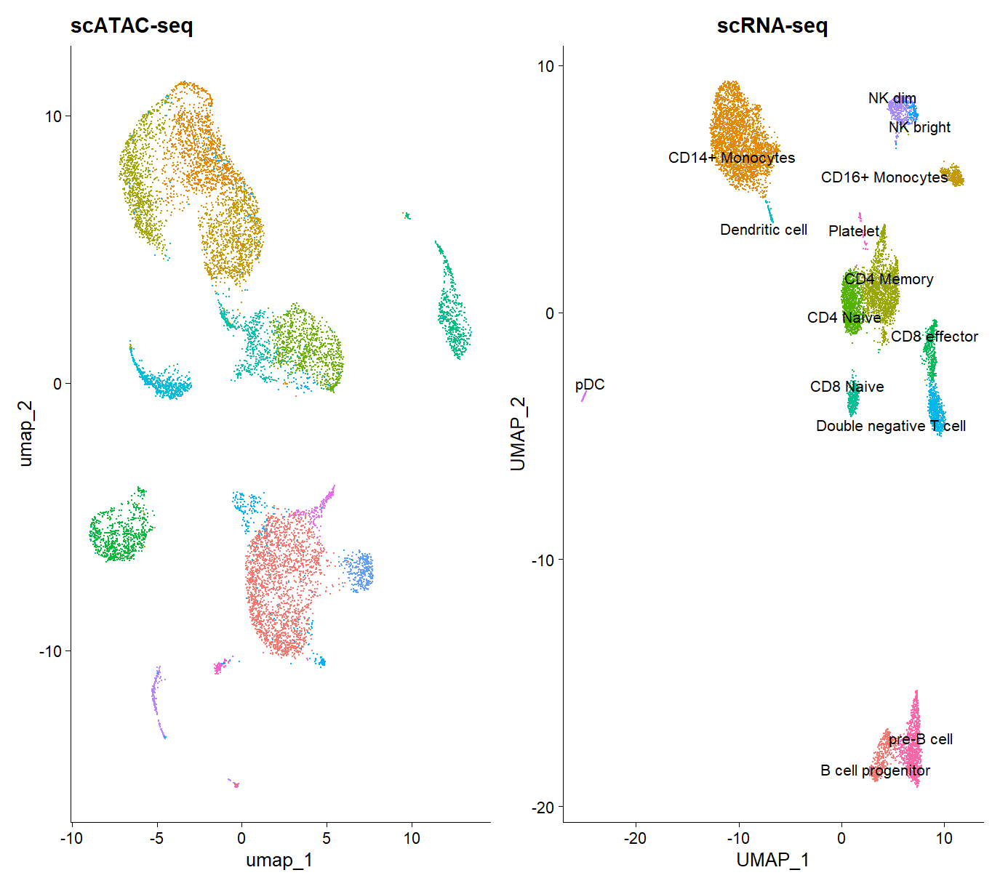

**What this shows:** Side-by-side UMAP comparison of the scATAC-seq data
(left, raw Leiden clusters) and the scRNA-seq reference (right, known cell
type labels from 10x PBMC v3 dataset).

**Key insight:** The global topology of both UMAPs matches — T cells, B cells,
monocytes, and NK cells occupy similar relative positions in both embeddings.
This validates that cross-modality label transfer using CCA will be accurate.

---

### Plot 8 — UMAP: Predicted Cell Type Labels After Label Transfer

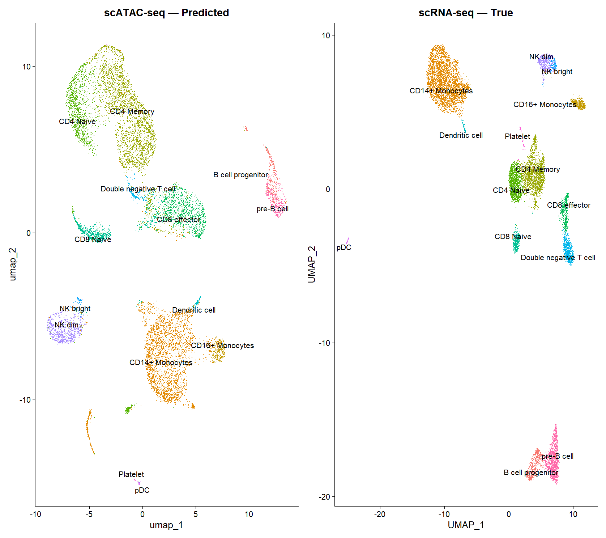

**What this shows:** The ATAC-seq UMAP after transferring cell type labels
from the scRNA-seq reference. All 15 Leiden clusters now have biological identities.

**Cell types identified in this dataset:**

| Cell type | N cells (approx) |
|-----------|-----------------|
| CD4 Naive | Most abundant T cell subset |
| CD4 Memory | — |
| CD8 Naive | — |
| CD8 effector | — |
| CD14+ Monocytes | Most abundant myeloid subset |
| CD16+ Monocytes | — |
| NK bright / NK dim | — |
| B cell progenitor | — |
| pre-B cell | — |
| Dendritic cell / pDC | — |
| Double negative T cell | — |
| Platelet | — |

---

### Plot 9 — Differential Accessibility: Violin + UMAP

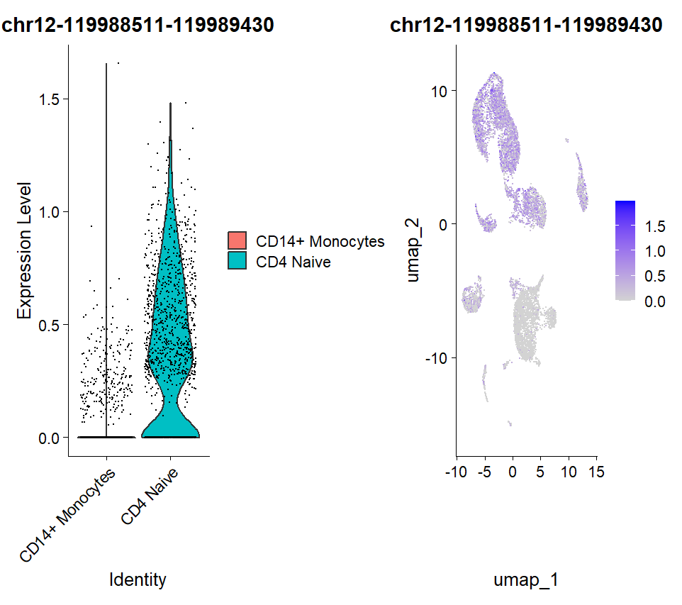

**What this shows:** The most differentially accessible peak between
CD4 Naive T cells and CD14+ Monocytes. Left panel = violin plot showing
per-cell accessibility; right panel = UMAP coloured by that peak's accessibility.

**Top DA peak:** `chr12-119988511-119989430`

**Key insight:** This peak is highly accessible in CD4 Naive T cells
(teal violin with broad distribution) but nearly completely closed in
CD14+ Monocytes (flat red violin at 0). On the UMAP, the coloured region
corresponds precisely to the T cell clusters, confirming specificity.

---

### Plot 10 — Coverage Plot: chr12 Region (BICDL1 gene)

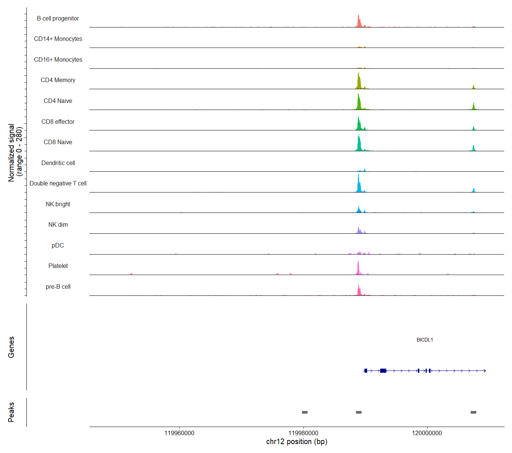

**What this shows:** Fragment density along chromosome 12 (~119,950,000–120,020,000)
containing the **BICDL1** gene. Each track = one cell type; track height =
normalised fragment count. Grey bars at bottom = called ATAC-seq peaks.

**Key insight:** The sharp accessibility peak at ~chr12:119,983,000 is
specifically open in T cell subtypes (CD4 Naive, CD4 Memory, CD8 Naive,
CD8 effector, Double negative T cell) and essentially closed in monocytes
(CD14+, CD16+) and B cells. This cell-type-specific open chromatin pattern
at a regulatory element near BICDL1 is consistent with T cell lineage identity.

---

### Plot 11 — Coverage Plot: CD8A Gene (chr2)

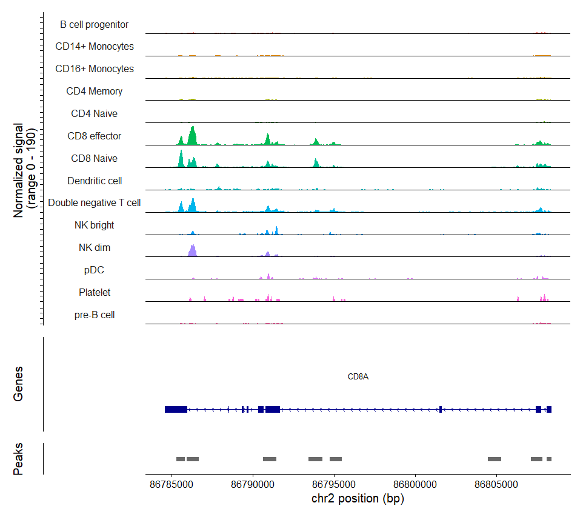

**What this shows:** Fragment density around the **CD8A** gene on chromosome 2
(~86,785,000–86,810,000). CD8A is the canonical CD8+ cytotoxic T cell surface marker.

**Key insight:** CD8A chromatin is specifically accessible in **CD8 Naive**
and **CD8 effector** T cells (tall, sharp peaks). Double negative T cells
and NK cells show intermediate signal. Monocytes, B cells, and CD4 T cells
show minimal accessibility — precisely matching known CD8A expression biology
and providing strong validation that the chromatin accessibility data correctly
reflects cell-type identity.

---

## 6. How to Run the Pipeline

```r
# 1. Set working directory to where your downloaded files are
setwd("C:/YOUR/PATH/TO/PROJECT")

# 2. Run the complete pipeline (~30–90 min depending on hardware)
source("ATACSeq_complete_pipeline.R")
```

**Saved outputs after completion:**

| File | Contents |
|------|---------|
| `data/pbmc_atac_part1.rds` | Object after QC, TF-IDF, LSI, UMAP, clustering |
| `data/pbmc_atac_final.rds` | Complete object with gene activity + cell type labels |
| `da_peaks_results.rds` | Differential accessibility table |
| `pbmc_atac_clusters.csv` | Cell barcode → cluster ID mapping |

---

## 7. How to Launch the Shiny App

> **Prerequisite:** `data/pbmc_atac_final.rds` must exist.

```r
# Option A: open Shiney_App_For_EDA.R in RStudio and click "Run App"

# Option B: from the R console
shiny::runApp("Shiney_App_For_EDA.R")
```

The app opens in your default browser automatically.

---

## 8. Shiny App — Full User Guide

### Layout Overview

```
┌──────────────────────────────────────────────────────────────┐
│  Sidebar (Controls)           │  Main Panel (5 Tabs)          │
│  ─────────────────────        │  ─────────────────────────    │
│  Step 1 — Chromosome          │  ┌── Info Boxes (top) ──┐    │
│    [chr2 ▼]                   │  │ Gene | Location | N  │    │
│                               │  └──────────────────────┘    │
│  Step 2 — Gene                │                               │
│    [CD8A ▼]                   │  Tab 1: Gene Activity         │
│                               │    violin + box plot          │
│  Step 3 — Cell Types (≥ 2)    │                               │
│    ☑ CD8 Naive                │  Tab 2: UMAP                  │
│    ☑ CD8 effector             │    feature plot               │
│    ☐ CD4 Naive                │                               │
│    ☐ CD14+ Monocytes          │  Tab 3: Coverage              │
│    …                          │    genome browser             │
│                               │                               │
│  [▶ Update Plots]             │  Tab 4: Gene Info             │
│  [Select All] [Clear All]     │    coordinates table          │
│                               │                               │
│                               │  Tab 5: Summary Stats         │
│                               │    per-cell-type table        │
└──────────────────────────────────────────────────────────────┘
```

### Workflow

**Step 1 — Select a chromosome:**
The dropdown contains all chromosomes that have annotated genes in the
gene activity matrix. Choosing a chromosome immediately updates the gene list.

**Step 2 — Select a gene:**
Only genes on the selected chromosome that are present in the gene activity
matrix are shown. The search box lets you type to filter (e.g. type "CD8" to
quickly find CD8A, CD8B etc.).

**Step 3 — Tick cell types:**
Select any 2 or more of the 15 predicted cell types. Only cells from the
ticked types appear in the plots. Use **Select All** and **Clear All** for bulk actions.

**Click Update Plots** — all 5 tabs refresh simultaneously.

---

### Tab Descriptions

| Tab | What you see | How to interpret |
|-----|-------------|-----------------|
| **Gene Activity** | Violin + boxplot per cell type | Wider violin = more cells at that activity level; significance brackets show Wilcoxon p-values |
| **UMAP** | All cells on UMAP; selected types coloured by gene activity | Non-selected cells = grey; colour intensity = chromatin accessibility level |
| **Coverage** | Genome browser tracks per selected cell type | Tall bumps = open chromatin; grey bars = called peaks |
| **Gene Info** | Table: chromosome, coordinates, strand, length | Useful to verify which genomic region you are analysing |
| **Summary Stats** | Table: N, Mean, Median, SD, % active cells per type | Bar-in-cell background shows relative mean activity across types |

---

## 9. File Descriptions

| File | Purpose |
|------|---------|
| `ATACSeq_complete_pipeline.R` | Full scATAC-seq analysis from raw count matrix to annotated cell types |
| `Shiney_App_For_EDA.R` | Interactive Shiny EDA app for exploring accessibility |
| `data/pbmc_atac_final.rds` | Final Seurat object with peaks + RNA + UMAP + cell type labels |
| `data/da_peaks_results.rds` | Differential accessibility results (CD4 Naive vs CD14+ Monocytes) |
| `pbmc_atac_clusters.csv` | Barcode → cluster/cell-type mapping table |

---

## 10. Common Errors and Fixes

| Error | Cause | Fix |
|-------|-------|-----|
| `Cannot find data/pbmc_atac_final.rds` | Pipeline not yet completed | Run `ATACSeq_complete_pipeline.R` first |
| App loads but gene dropdown is empty | Chromosome has no annotated genes | Select a different chromosome (chr1, chr2) |
| Coverage tab shows error message | Fragment file moved from original path | Place `fragments.tsv.gz` + `.tbi` in the project working directory |
| No cells found after Update Plots | Fewer than 2 cell types ticked | Tick at least 2 cell types |
| Significance brackets not appearing | More than 6 cell types selected | Select 2–6 cell types for brackets |
| `Error: package 'shinydashboard' not found` | Package not installed | `install.packages("shinydashboard")` |
| `Error: package 'DT' not found` | Package not installed | `install.packages("DT")` |

---

## Acknowledgements

- **[Bioinformagician (YouTube)](https://www.youtube.com/@Bioinformagician)** —
  tutorial walkthrough that guided the analytical structure of this pipeline.
  Code concepts and workflow order were inspired by their scATAC-seq tutorial series.
- **[Signac / Stuart Lab](https://stuartlab.org/signac/)** — core R package
  for scATAC-seq; official PBMC vignette methodology
- **[10x Genomics](https://www.10xgenomics.com)** — PBMC ATACv2 dataset
- **[Ensembl / AnnotationHub](https://bioconductor.org/packages/AnnotationHub)** —
  hg38 gene annotations (EnsDb v98, AH75011)
- **[ENCODE Project](https://www.encodeproject.org)** — genomic blacklist regions

---

*Pipeline: Signac v1.17+ · Seurat v5 · R 4.6 · Genome: hg38 · Ensembl v98*
